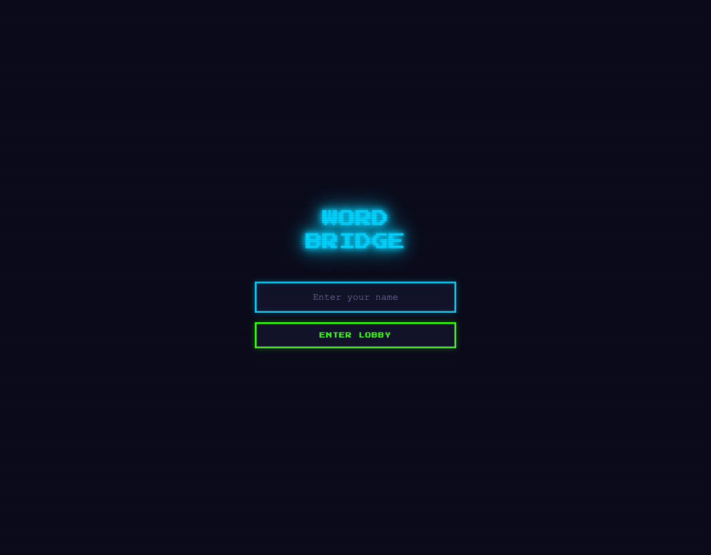

# WordBridge

A 1v1 real-time multiplayer word game where two players compete to find words matching shared letter pairs.



## Quick Start

```bash
npm install
npm start
```

Then open **http://localhost:3000** in two browser tabs.

## How to Play

1. Enter your name and click **Enter Lobby**
2. Send a challenge to an online opponent
3. When they accept, a 10-round match begins
4. Each round: see a letter pair (e.g., A...T)
5. Type a word starting with **A** and ending with **T** (e.g., "adapt")
6. Press Enter to submit
7. Shorter time = more points. First valid submission gets +1 bonus.

## Game Rules

- **Word validation**: Must exist in dictionary, exact S-L match
- **Invalid word**: 0 points for that round
- **Speed bonus**: First valid submission gets +1 point
- **Disconnection**: Opponent wins by forfeit

## Project Structure

```
├── server.js        # Node.js + Express + Socket.io server
├── game.js          # Client-side Socket.io logic
├── index.html       # Single-page app with screen state machine
├── style.css        # Styling
├── word_lookup.json # Pre-computed word lookup (660 S-L buckets)
├── build_lookup.js  # Build script for word_lookup.json
└── package.json     # Dependencies
```

## Remote Access (Public URL)

To make the game accessible from anywhere, use a tunnel:

### Cloudflare Tunnel (Recommended)

```bash
# Install cloudflared if needed
brew install cloudflared

# Run tunnel (temporary URL)
cloudflared tunnel --url http://localhost:3000
```

### Ngrok

```bash
# Install ngrok if needed
brew install ngrok

# Run tunnel (requires account)
ngrok http 3000
```

### LocalTunnel

```bash
npx localtunnel --port 3000
```

## Architecture

- **Server**: Express + Socket.io, manages game rooms and real-time state
- **Client**: Single-page app with screen-state machine (lobby → challenging → game → results → end)
- **Dictionary**: Pre-computed S-L pair lookup (~360K words)
- **Timing**: Server-synchronized timer (10 seconds per round)

## Socket Events

See `AGENTS.md` for full socket event documentation.