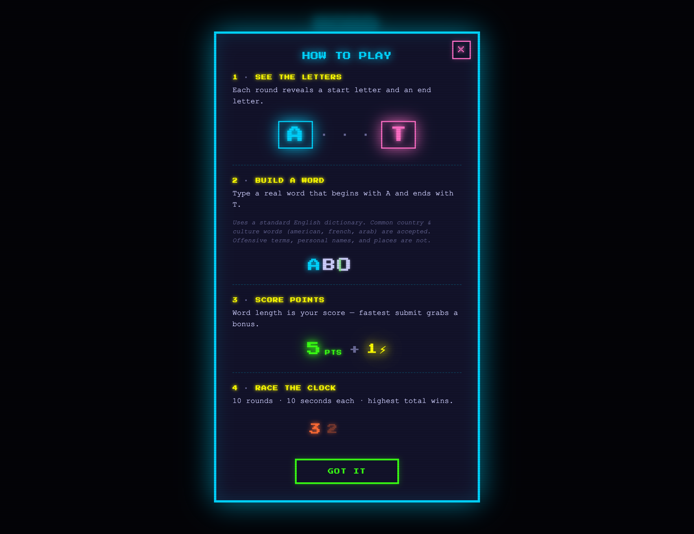

# WordBridge

A real-time multiplayer word game where 2-8 players compete to find words matching shared letter pairs.



## Quick Start

```bash
npm install
npm start
```

Then open **http://localhost:3000** in two browser tabs.

## How to Play

1. Enter your name and click **Enter Lobby**
2. Create a room or join with a 6-character room code from a friend
3. Both players ready up, host clicks **Start Game**
4. 10 rounds, 10 seconds each: see a letter pair (e.g., A...T)
5. Type a word starting with **A** and ending with **T** (e.g., "about")
6. Press Enter to submit — fastest valid word gets +1 bonus
7. After each round, see both words and updated scores
8. Highest total after 10 rounds wins

## Game Rules

- **Word validation**: Must exist in dictionary, exact S-L match
- **Invalid word**: 0 points for that round
- **Speed bonus**: First valid submission gets +1 point
- **Word categories**: Host can toggle noun/verb/adjective/country categories
- **Dictionary**: ~116K words from SCOWL 70, with curated demonyms (american, french, arab)
- **Offensive terms**: Filtered out
- **Disconnection**: Opponent wins by forfeit

## Project Structure

```
├── server.js              # Node.js + Express + Socket.io server
├── game.js                # Client-side Socket.io logic
├── index.html             # Single-page app with screen state machine
├── style.css              # Retro arcade styling
├── word_lookup.json       # Pre-computed word lookup (601 S-L buckets)
├── word_categories.json   # Word-to-category mapping
├── build_lookup.js        # Build script for dictionary data
├── words_scowl70.txt      # Source dictionary (SCOWL 70)
├── package.json           # Dependencies
└── assets/                # Screenshots and assets
```

## Deployment

### Render (Recommended)

1. Create a free account at [render.com](https://render.com)
2. Connect your GitHub repository
3. Create a new **Web Service** — Render auto-detects `render.yaml`
4. Deploys automatically on push to `master`

Or use the [Render CLI](https://render.com/docs/cli):

```bash
npm install -g @render/cli
render login
render deploy
```

### Cloudflare Tunnel (Quick Alternative)

```bash
# Install cloudflared if needed
brew install cloudflared

# Run tunnel (temporary URL)
cloudflared tunnel --url http://localhost:3000
```

### Ngrok (Quick Alternative)

```bash
# Install ngrok if needed
brew install ngrok

# Run tunnel (requires account)
ngrok http 3000
```

### LocalTunnel (Quick Alternative)

```bash
npx localtunnel --port 3000
```

## Architecture

- **Server**: Express + Socket.io, manages game rooms for 2-8 players
- **Client**: Single-page app with screen-state machine (name → lobby → room lobby → game → results → game end)
- **Dictionary**: Pre-computed S-L pair lookup (~116K words, 601 active buckets)
- **Categories**: Nouns, verbs, adjectives, adverbs, countries — host-configurable
- **Timing**: Server-synchronized timer (10 seconds per round, 5-second pause between rounds)
- **Profiles**: Player profiles with emoji avatars

## Socket Events

See `AGENTS.md` for full socket event documentation.

## License

MIT — see [LICENSE](LICENSE)